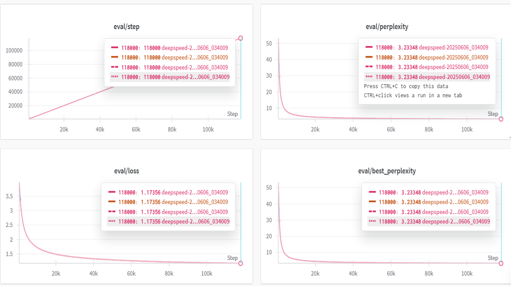
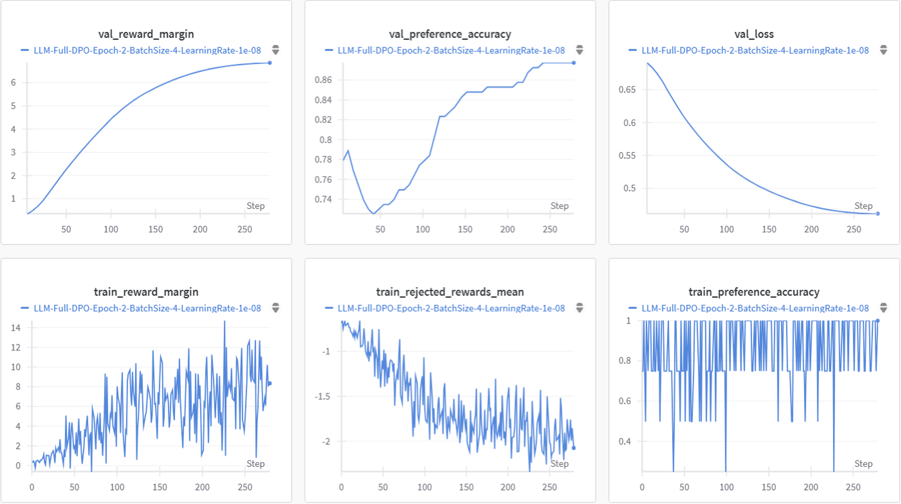

  <h1>自然语言处理大项目</h1>

  中文 | <a href="./README_en.md">English</a>

221900448 周天远

## 项目简述

本小组完成了从预训练、全量监督微调、LoRA 微调，到 RLHF（基于人类反馈的强化学习）以及推理模型训练(Reasoning Model)的一整套 LLM 训练流程。是课堂答辩中唯一一个 **完整实现并全部达标** 所有任务的小组。当前，我们还进一步扩展了全量监督微调和推理模型的训练工作。

------

## 快速开始

- **预训练快速开始**：详见 [README_PRETRAIN.md](./README_PRETRAIN.md)
- **高级任务快速开始（监督微调 / LoRA / RLHF / 推理模型）**：详见 [advance/README_ADVANCE.md](./advance/README_ADVANCE.md)

## 项目亮点

### 训练效率优化

- **DeepSpeed ZeRO-2 加速训练**：利用 ZeRO-2 优化器，显著提升训练效率并优化显存资源利用。
- **FP16 混合精度 + CPU Offload**：引入混合精度训练与部分参数转移至 CPU，有效减少显存压力，加快训练速度。
- **4卡并行训练，内存占用减半**：多卡训练架构显著提升了训练吞吐量，同时降低了单卡显存负担。
- **Wandb 实时监控**：使用 Weights & Biases 实现训练过程可视化，便于观察模型收敛情况和调参，无需依赖手动 `print` 与日志检查。

### 模型效果优化

- **预先全监督微调增强 LoRA 效果**：在 LoRA 微调前进行一次全监督微调，有效提升最终微调性能。
- **引入推理模型训练**：主动探索 LLM 新范式，通过训练推理模型进一步提升模型生成能力。
- **DPO 替代 PPO 优化 RLHF 流程**：
  - DPO（Direct Preference Optimization）通过显式优化目标替代了原 PPO 的复杂奖励估计过程；
  - 仅需训练 Actor 与 Ref 模型，无需在线奖励模型，大幅降低计算与显存开销；
  - 同时提高了训练稳定性，且性能几乎无损。

------

## 训练成果展示

### 预训练阶段

- **训练集表现**
   
- **验证集表现**
   

### 监督微调结果

### LoRA 微调结果

### RLHF 阶段结果

### 推理模型训练结果

