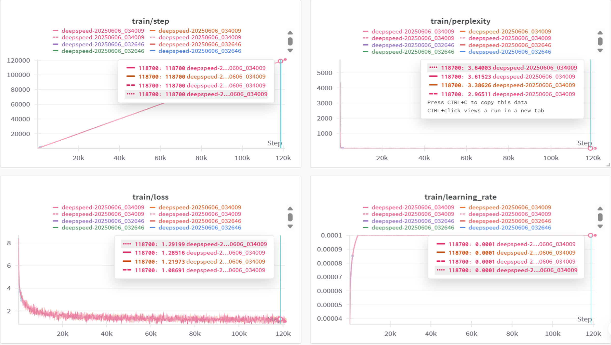
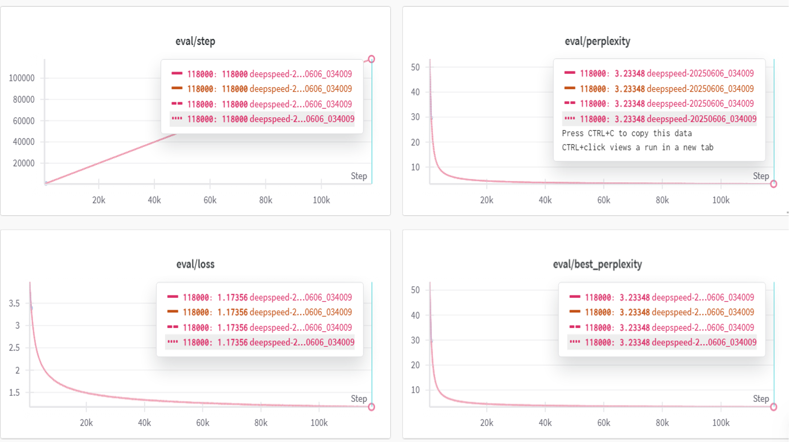
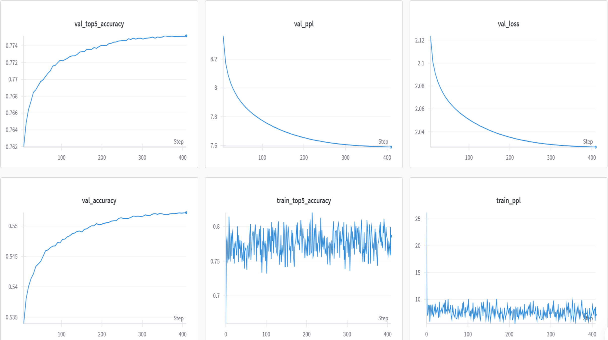
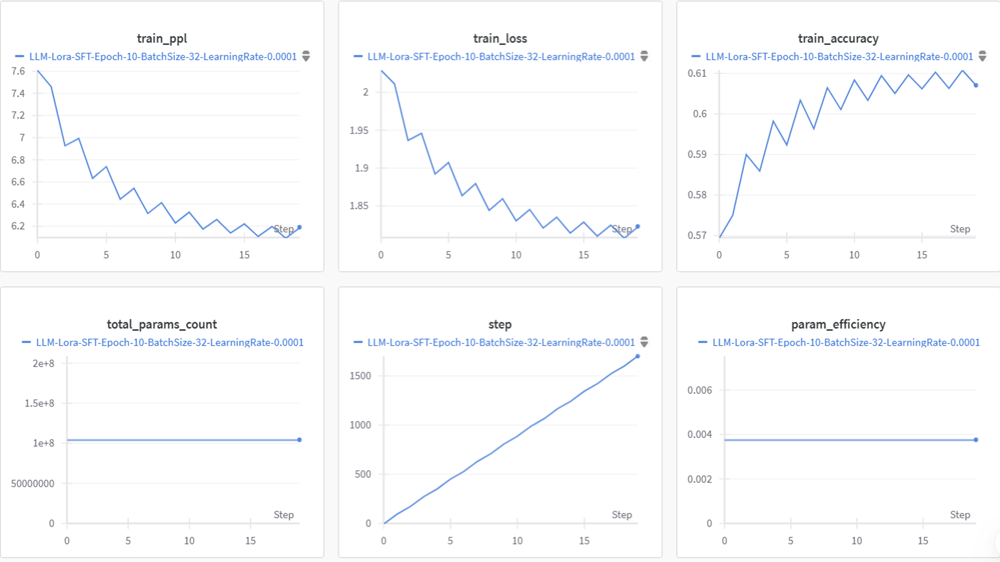
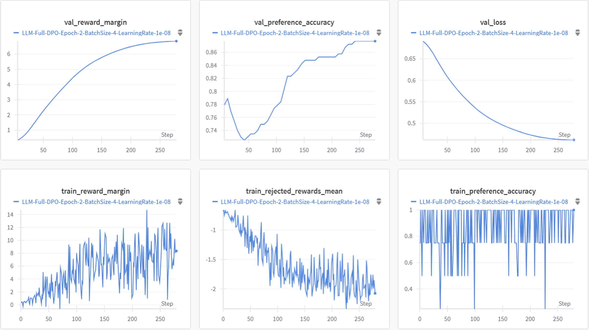

  <h1>Natural Language Processing Project</h1>

[中文](./README.md) | English

221900448 Martin Zhou

## Project Overview

Our team has successfully completed the **entire LLM training pipeline**, including pretraining, full supervised fine-tuning, LoRA fine-tuning, RLHF (Reinforcement Learning from Human Feedback), and inference model training. We are the **only team** to have completed **all tasks** and **met the requirements** during the final presentation. We are also actively extending the full supervised fine-tuning and inference model components.

---

## 🚀 Quick Start

- 🔧 **Pretraining Quick Start**: See [README_PRETRAIN.md](./README_PRETRAIN.md)  
- 🧠 **Advanced Tasks Quick Start (SFT / LoRA / RLHF / Inference Model)**: See [advance/README_ADVANCE.md](./advance/README_ADVANCE.md)

## 🔍 Project Highlights

### Training Efficiency Optimization

- **DeepSpeed ZeRO-2 Acceleration**: Leverages ZeRO-2 optimizer to significantly improve training efficiency and memory usage.
- **FP16 + CPU Offload**: Uses mixed-precision training and CPU offloading to reduce GPU memory consumption and boost speed.
- **4-GPU Parallel Training**: Achieves higher throughput and lower per-GPU memory usage with 4-GPU parallelism.
- **Wandb for Real-Time Monitoring**: Visualizes training progress in real-time via Weights & Biases, eliminating reliance on manual logs or print statements.

### Model Performance Optimization

- **Pre-SFT Before LoRA Improves Performance**: Performing full supervised fine-tuning before LoRA leads to better downstream results.
- **Inference Model Training**: Explores new paradigms in LLM training by adding reasoning-focused distillation.
- **DPO Replaces PPO in RLHF**:
  - DPO (Direct Preference Optimization) replaces PPO's complex reward model with a direct and more stable objective;
  - Only the Actor and Ref models are needed—no online reward model—greatly reducing GPU usage;
  - Improves training stability while maintaining similar performance.

---

## 📊 Training Results

### Pretraining Phase

- **Training Set Performance**  
  

- **Validation Set Performance**  
  

### Supervised Fine-Tuning (SFT)

### LoRA Fine-Tuning

### RLHF (DPO) Training

### Inference Model Training

